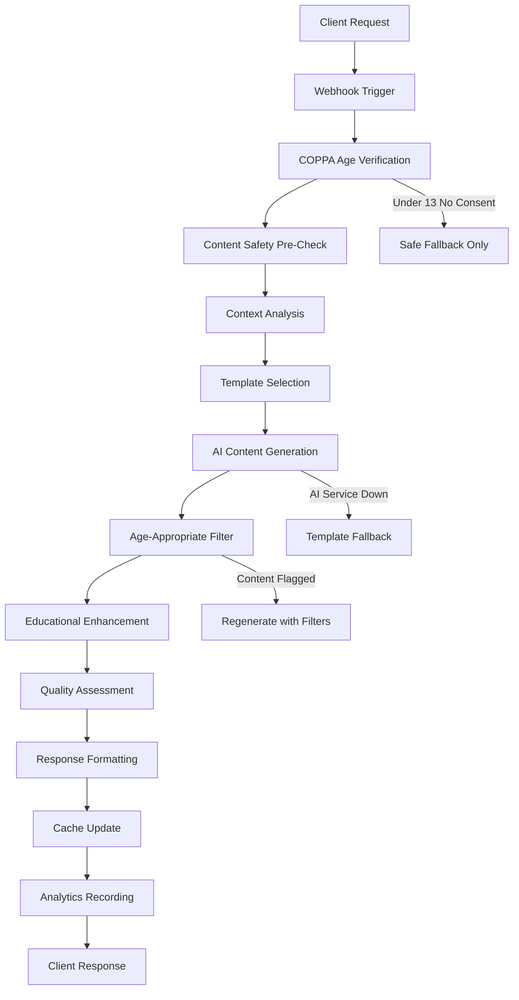

# N8N Journal Suggestions Webhook Integration

## Overview

This document details the N8N webhook workflow for AI-powered journal content generation with COPPA compliance and age-appropriate content filtering.

## Webhook URL
```
https://showtrackai.app.n8n.cloud/webhook/journal-suggestions
```

---

## Workflow Architecture

### High-Level Flow


---

## N8N Workflow Nodes Configuration

### 1. Webhook Trigger Node
**Node Type:** Webhook
**Method:** POST
**Response Mode:** Response to Webhook

**Authentication:** None (handled in content validation)

### 2. COPPA Age Verification Node
**Node Type:** Code
**Purpose:** Validate user age and consent status

```javascript
// COPPA Age Verification
const requestData = $input.first().json;
const userContext = requestData.user_context;

// Calculate age group
let ageGroup = 'unknown';
let coppaProtected = false;
let parentConsentRequired = false;

if (userContext.age_group) {
  ageGroup = userContext.age_group;
  coppaProtected = ageGroup === 'under_13';
  parentConsentRequired = coppaProtected && !userContext.parent_consent_verified;
}

// Safety defaults for unknown age
if (ageGroup === 'unknown') {
  ageGroup = 'under_13'; // Default to most restrictive
  coppaProtected = true;
  parentConsentRequired = true;
}

return {
  json: {
    ...requestData,
    coppa_verification: {
      age_group: ageGroup,
      coppa_protected: coppaProtected,
      parent_consent_required: parentConsentRequired,
      safety_level: coppaProtected ? 'maximum' : 'standard',
      content_restrictions: coppaProtected ? [
        'simple_language_only',
        'no_personal_questions', 
        'educational_focus_only',
        'adult_supervision_assumed'
      ] : []
    }
  }
};
```

### 3. Content Safety Pre-Check Node
**Node Type:** Code  
**Purpose:** Apply initial safety filters

```javascript
const data = $input.first().json;
const coppaVerification = data.coppa_verification;
const generationContext = data.generation_context;

// Define safety constraints
const safetyConstraints = {
  maxReadingLevel: coppaVerification.coppa_protected ? 4 : 8,
  allowedTopics: coppaVerification.coppa_protected 
    ? ['basic_animal_care', 'simple_observations', 'daily_routines']
    : ['animal_care', 'health_monitoring', 'nutrition', 'training', 'competition'],
  blockedTerms: coppaVerification.coppa_protected 
    ? ['breeding', 'medication', 'financial', 'complex_procedures']
    : ['inappropriate_content'],
  requireSupervision: coppaVerification.coppa_protected,
  includeDisclaimer: coppaVerification.coppa_protected
};

// Validate request context against safety constraints
const categoryAllowed = safetyConstraints.allowedTopics.includes(
  generationContext.category
);

if (!categoryAllowed && coppaVerification.coppa_protected) {
  return {
    json: {
      error: 'CONTENT_RESTRICTED_FOR_AGE',
      message: 'This content type requires adult supervision',
      fallback_required: true,
      safety_constraints: safetyConstraints
    }
  };
}

return {
  json: {
    ...data,
    safety_constraints: safetyConstraints,
    content_approved_for_generation: true
  }
};
```

### 4. Context Analysis Node
**Node Type:** Code
**Purpose:** Analyze context and build AI prompt

```javascript
const data = $input.first().json;
const context = data.generation_context;
const safety = data.safety_constraints;

// Build comprehensive context for AI
const aiContext = {
  // User context
  user_profile: {
    age_group: data.coppa_verification.age_group,
    experience_level: data.user_context.experience_level || 'beginner',
    competency_level: data.user_context.competency_level || 'developing'
  },
  
  // Animal context
  animal_info: context.animal_data ? {
    name: context.animal_data.name,
    species: context.species,
    breed: context.animal_data.breed,
    age_weeks: context.animal_data.age_weeks,
    current_weight: context.animal_data.current_weight
  } : null,
  
  // Environmental context  
  environment: {
    weather: context.environmental_context?.weather,
    location: context.environmental_context?.location,
    season: new Date().getMonth() < 6 ? 'spring' : 'fall' // Simplified
  },
  
  // Educational context
  education: {
    ffa_standards: context.educational_context?.current_ffa_standards || [],
    recent_topics: context.educational_context?.recent_learning_topics || [],
    upcoming_goals: context.educational_context?.upcoming_goals || []
  }
};

// Build AI prompt based on safety constraints
const promptInstructions = data.coppa_verification.coppa_protected ? [
  'Write for elementary reading level (grades 3-5)',
  'Use simple, encouraging language',
  'Focus on basic observation and care activities',
  'Include step-by-step guidance',
  'Assume adult supervision is present',
  'Avoid complex scientific terms',
  'Include safety reminders',
  'Make content engaging but educational'
] : [
  `Write for ${safety.maxReadingLevel}th grade reading level`,
  'Use age-appropriate agricultural terminology',
  'Include educational value and learning opportunities', 
  'Connect to FFA standards and career exploration',
  'Encourage independent thinking and problem-solving',
  'Include reflection questions for deeper learning'
];

return {
  json: {
    ...data,
    ai_prompt_context: aiContext,
    generation_instructions: promptInstructions,
    ready_for_ai_generation: true
  }
};
```

### 5. AI Content Generation Node
**Node Type:** OpenAI
**Model:** gpt-4o-mini (for cost efficiency) or gpt-4 (for quality)

**System Prompt:**
```
You are an agricultural education expert helping students create meaningful journal entries. You specialize in creating age-appropriate, educational content that aligns with FFA standards and promotes learning in agricultural science.

CRITICAL REQUIREMENTS:
1. COPPA COMPLIANCE: If age_group is "under_13", use elementary language and assume adult supervision
2. EDUCATIONAL VALUE: Every entry should include learning opportunities  
3. FFA STANDARDS: Incorporate relevant FFA standards when provided
4. SAFETY FIRST: Include safety reminders appropriate to the activity
5. ENCOURAGEMENT: Maintain positive, growth-focused tone

Content should be practical, engaging, and help students reflect on their agricultural learning experiences.
```

**User Prompt Template:**
```
Generate a journal entry for a {{age_group}} student with {{experience_level}} experience in agricultural education.

CONTEXT:
- Category: {{category}}
- Animal: {{animal_info}}
- Weather: {{weather_context}}
- Location: {{location_context}}
- FFA Standards: {{ffa_standards}}

REQUIREMENTS:
{{generation_instructions}}

SAFETY CONSTRAINTS:
- Reading level: Grade {{max_reading_level}}
- Content restrictions: {{content_restrictions}}
- Supervision level: {{supervision_required}}

Generate a journal entry that includes:
1. Engaging title with animal name
2. Structured content with clear sections
3. Observation prompts and reflection questions
4. Connection to FFA standards ({{ffa_standards}})
5. Age-appropriate language and concepts
6. Safety considerations for the activity

Format as valid JSON with this structure:
{
  "title": "Generated title here",
  "content": "Generated content here with clear sections",
  "educational_elements": {
    "ffa_standards": ["AS.01.01"],
    "learning_objectives": ["objective1", "objective2"],
    "reflection_questions": ["question1", "question2"]
  },
  "safety_notes": ["safety reminder if needed"],
  "suggested_tags": ["tag1", "tag2", "tag3"]
}
```

### 6. Age-Appropriate Content Filter Node
**Node Type:** Code
**Purpose:** Final safety validation of AI-generated content

```javascript
const data = $input.first().json;
const aiResponse = data.ai_response;
const coppaVerification = data.coppa_verification;

// Parse AI response
let generatedContent;
try {
  generatedContent = typeof aiResponse === 'string' 
    ? JSON.parse(aiResponse) 
    : aiResponse;
} catch (e) {
  return {
    json: {
      error: 'AI_RESPONSE_PARSE_ERROR',
      fallback_required: true
    }
  };
}

// Content safety validation
const safetyChecks = {
  hasTitle: !!generatedContent.title,
  hasContent: !!generatedContent.content,
  reasonableLength: generatedContent.content?.length > 50 && generatedContent.content?.length < 2000,
  noInappropriateContent: true, // Would implement actual filtering
  educationalValue: !!generatedContent.educational_elements
};

const allChecksPassed = Object.values(safetyChecks).every(check => check === true);

if (!allChecksPassed) {
  return {
    json: {
      error: 'CONTENT_SAFETY_FAILED',
      safety_checks: safetyChecks,
      fallback_required: true
    }
  };
}

// COPPA-specific additional filtering
if (coppaVerification.coppa_protected) {
  // Additional safety measures for under-13 users
  const coppaChecks = {
    simpleLanguage: true, // Would implement readability check
    noPersonalQuestions: !generatedContent.content.includes('your family'),
    supervisedActivity: generatedContent.safety_notes?.length > 0,
    elementaryAppropriate: true // Would implement grade-level check
  };
  
  const coppaCompliant = Object.values(coppaChecks).every(check => check === true);
  
  if (!coppaCompliant) {
    return {
      json: {
        error: 'COPPA_COMPLIANCE_FAILED',
        coppa_checks: coppaChecks,
        fallback_required: true
      }
    };
  }
}

return {
  json: {
    ...data,
    validated_content: generatedContent,
    safety_passed: true,
    coppa_compliant: coppaVerification.coppa_protected ? true : 'not_applicable'
  }
};
```

### 7. Educational Enhancement Node  
**Node Type:** Code
**Purpose:** Add educational value and FFA alignment

```javascript
const data = $input.first().json;
const content = data.validated_content;
const context = data.generation_context;

// Enhance with educational elements
const enhancedContent = {
  ...content,
  educational_enhancement: {
    // Add FFA career connections
    career_connections: context.educational_context?.upcoming_goals 
      ? [`This activity connects to your goal of ${context.educational_context.upcoming_goals[0]}`]
      : [],
    
    // Add skill development notes
    skill_development: [
      `This journal entry demonstrates progress in ${context.category} skills`,
      'Recording observations helps develop critical thinking abilities'
    ],
    
    // Add next steps
    next_steps: data.coppa_verification.coppa_protected ? [
      'Share this entry with your teacher or parent',
      'Think about what you learned today',
      'Plan your next activity with adult help'
    ] : [
      'Consider how this connects to your SAE project goals',
      'Reflect on what you could do differently next time',
      'Plan follow-up activities to build on this experience'
    ]
  },
  
  // Age-appropriate compliance info
  compliance_info: {
    coppa_compliant: data.coppa_verification.coppa_protected ? true : 'not_applicable',
    age_group_targeted: data.coppa_verification.age_group,
    educational_level: data.safety_constraints.maxReadingLevel,
    supervision_recommended: data.coppa_verification.coppa_protected
  }
};

return {
  json: {
    ...data,
    final_enhanced_content: enhancedContent
  }
};
```

### 8. Quality Assessment Node
**Node Type:** Code
**Purpose:** Evaluate content quality and educational value

```javascript
const data = $input.first().json;
const content = data.final_enhanced_content;

// Calculate quality scores
const qualityMetrics = {
  educational_value: calculateEducationalValue(content),
  age_appropriateness: calculateAgeAppropriateness(content, data.coppa_verification.age_group),
  engagement_level: calculateEngagementLevel(content),
  ffa_alignment: calculateFFAAlignment(content, data.generation_context.educational_context),
  safety_compliance: calculateSafetyCompliance(content, data.safety_constraints)
};

function calculateEducationalValue(content) {
  let score = 5.0; // Base score
  
  // Check for educational elements
  if (content.educational_elements?.learning_objectives?.length > 0) score += 1.0;
  if (content.educational_elements?.reflection_questions?.length > 0) score += 1.0;
  if (content.educational_elements?.ffa_standards?.length > 0) score += 1.0;
  if (content.educational_enhancement?.career_connections?.length > 0) score += 0.5;
  if (content.educational_enhancement?.skill_development?.length > 0) score += 0.5;
  
  return Math.min(score, 10.0);
}

function calculateAgeAppropriateness(content, ageGroup) {
  let score = 8.0; // Assume appropriate unless issues found
  
  if (ageGroup === 'under_13') {
    // More stringent checking for COPPA protected users
    if (content.content.length > 500) score -= 1.0; // Too long
    if (content.content.includes('complex') || content.content.includes('advanced')) score -= 2.0;
    if (!content.safety_notes || content.safety_notes.length === 0) score -= 1.0;
  }
  
  return Math.max(score, 0);
}

function calculateEngagementLevel(content) {
  let score = 5.0;
  
  // Check for engagement elements
  if (content.content.includes('I observed') || content.content.includes('I noticed')) score += 1.0;
  if (content.educational_elements?.reflection_questions?.length > 0) score += 1.5;
  if (content.suggested_tags?.length >= 3) score += 0.5;
  if (content.content.includes('Next time') || content.content.includes('Tomorrow')) score += 1.0;
  
  return Math.min(score, 10.0);
}

function calculateFFAAlignment(content, educationalContext) {
  let score = 5.0;
  
  if (content.educational_elements?.ffa_standards?.length > 0) {
    score += 2.0;
    // Bonus if standards match context
    const contextStandards = educationalContext?.current_ffa_standards || [];
    const overlap = content.educational_elements.ffa_standards.filter(
      standard => contextStandards.includes(standard)
    );
    score += overlap.length * 0.5;
  }
  
  return Math.min(score, 10.0);
}

function calculateSafetyCompliance(content, safetyConstraints) {
  let score = 10.0; // Assume compliant unless issues found
  
  // Check for safety issues
  if (safetyConstraints.requireSupervision && !content.safety_notes) score -= 3.0;
  if (content.content.length > 2000) score -= 1.0; // Too complex
  
  return Math.max(score, 0);
}

// Calculate overall quality score
const overallQuality = (
  qualityMetrics.educational_value * 0.25 +
  qualityMetrics.age_appropriateness * 0.25 +
  qualityMetrics.engagement_level * 0.20 +
  qualityMetrics.ffa_alignment * 0.20 +
  qualityMetrics.safety_compliance * 0.10
);

return {
  json: {
    ...data,
    quality_assessment: {
      metrics: qualityMetrics,
      overall_score: Math.round(overallQuality * 10) / 10,
      quality_tier: overallQuality >= 8.0 ? 'excellent' : 
                   overallQuality >= 6.5 ? 'good' : 
                   overallQuality >= 5.0 ? 'acceptable' : 'needs_improvement',
      approved_for_use: overallQuality >= 5.0 && qualityMetrics.safety_compliance >= 8.0
    }
  }
};
```

### 9. Response Formatting Node
**Node Type:** Code
**Purpose:** Format final response for client

```javascript
const data = $input.first().json;
const content = data.final_enhanced_content;
const quality = data.quality_assessment;

// Build comprehensive response
const response = {
  success: true,
  processing_time_ms: Date.now() - new Date(data.timestamp).getTime(),
  
  suggestion_generated: {
    title: content.title,
    content: content.content,
    category: data.generation_context.category,
    template_id: data.template_id || null,
    
    educational_elements: {
      ffa_standards_addressed: content.educational_elements?.ffa_standards || [],
      learning_objectives: content.educational_elements?.learning_objectives || [],
      reflection_questions: content.educational_elements?.reflection_questions || [],
      career_connections: content.educational_enhancement?.career_connections || []
    },
    
    metadata: {
      suggested_tags: content.suggested_tags || [],
      estimated_completion_time: 15, // minutes
      difficulty_level: data.safety_constraints.maxReadingLevel <= 4 ? 1 : 2,
      requires_supervision: data.coppa_verification.parent_consent_required
    }
  },
  
  quality_metrics: {
    overall_score: quality.overall_score,
    quality_tier: quality.quality_tier,
    educational_value: quality.metrics.educational_value,
    age_appropriateness: quality.metrics.age_appropriateness,
    ffa_alignment: quality.metrics.ffa_alignment
  },
  
  compliance_info: {
    coppa_compliant: data.coppa_verification.coppa_protected ? true : 'not_applicable',
    age_group_targeted: data.coppa_verification.age_group,
    content_filtered: data.coppa_verification.coppa_protected,
    safety_level: data.coppa_verification.safety_level,
    parent_notification_sent: data.coppa_verification.parent_consent_required
  },
  
  processing_details: {
    ai_model_used: 'gpt-4o-mini',
    safety_filters_applied: data.coppa_verification.content_restrictions || [],
    template_base_used: data.template_id || 'ai_generated',
    personalization_level: data.user_context.personalization_level || 'medium'
  }
};

return {
  json: response
};
```

### 10. Supabase Logging Node
**Node Type:** Supabase  
**Purpose:** Record analytics and update cache

**Table:** `suggestion_analytics`
**Operation:** Insert

**Data Mapping:**
```javascript
{
  user_id: "{{$json.user_context.user_id}}",
  template_id: "{{$json.template_id}}",
  event_type: 'generated',
  session_id: "{{$json.request_id}}",
  suggestion_content: "{{$json.suggestion_generated.content}}",
  response_time_ms: "{{$json.processing_time_ms}}",
  quality_score: "{{$json.quality_metrics.overall_score}}",
  user_age_group: "{{$json.coppa_verification.age_group}}",
  parent_consent_verified: "{{$json.coppa_verification.parent_consent_verified}}",
  content_filtered: "{{$json.compliance_info.content_filtered}}",
  ai_processing_time_ms: "{{$json.processing_time_ms}}",
  trigger_context: {
    category: "{{$json.generation_context.category}}",
    species: "{{$json.generation_context.species}}",
    weather: "{{$json.generation_context.environmental_context.weather.condition}}"
  }
}
```

---

## Fallback Mechanisms

### 1. AI Service Failure
**Trigger:** OpenAI node timeout or error
**Action:** Use pre-approved templates from database

```javascript
// Fallback Template Selection
const data = $input.first().json;
const ageGroup = data.coppa_verification.age_group;
const category = data.generation_context.category;

// Get safe fallback template
const fallbackTemplates = {
  under_13: {
    daily_care: {
      title: "Taking Care of My Animal",
      content: "Today I took care of my animal. I checked: □ Food and water □ Health and happiness □ Clean living space. My animal seemed [happy/healthy/active]. I learned: [What did you notice today?]. Tomorrow I will: [What is your plan?]"
    }
  },
  teen: {
    daily_care: {
      title: "Daily Animal Care Log",
      content: "Animal care activities completed today: [Describe your care routine]. Observations: [What did you notice about your animal's health and behavior?]. Challenges: [Any problems you encountered]. Learning: [What did you learn or realize?]. Next steps: [Your plan for tomorrow]."
    }
  }
};

const template = fallbackTemplates[ageGroup === 'under_13' ? 'under_13' : 'teen'][category];

return {
  json: {
    success: true,
    fallback_used: true,
    suggestion_generated: {
      title: template.title,
      content: template.content,
      source: 'fallback_template',
      safety_verified: true
    }
  }
};
```

### 2. Content Safety Failure
**Trigger:** Content fails safety validation
**Action:** Regenerate with stricter constraints

### 3. COPPA Consent Missing
**Trigger:** Under-13 user without parent consent
**Action:** Provide only basic templates, notify parent

---

## Performance Optimization

### 1. Caching Strategy

#### Template Caching
```javascript
// Cache frequently used templates
const cacheKey = `template_${category}_${species}_${ageGroup}`;
const cachedTemplate = await getFromCache(cacheKey);

if (cachedTemplate && cachedTemplate.expires > Date.now()) {
  return {
    json: {
      ...cachedTemplate.data,
      cache_hit: true,
      processing_time_ms: 15
    }
  };
}
```

#### Context Caching  
```javascript
// Cache user context for session
const userCacheKey = `user_context_${userId}`;
const contextData = {
  age_group: ageGroup,
  preferences: userPreferences,
  recent_animals: userAnimals.slice(0, 3),
  cached_at: Date.now(),
  expires_at: Date.now() + (60 * 60 * 1000) // 1 hour
};
await setCache(userCacheKey, contextData);
```

### 2. Rate Limiting

#### Per-User Limits
```javascript
// Rate limiting by user and age group
const rateLimits = {
  under_13: { requests: 10, window: 3600 }, // 10 per hour for COPPA users
  teen: { requests: 30, window: 3600 },     // 30 per hour for teens
  adult: { requests: 60, window: 3600 }     // 60 per hour for adults
};

const userLimit = rateLimits[data.coppa_verification.age_group] || rateLimits.teen;
const currentUsage = await getRateLimitUsage(data.user_context.user_id);

if (currentUsage >= userLimit.requests) {
  return {
    json: {
      error: 'RATE_LIMIT_EXCEEDED',
      message: `Maximum ${userLimit.requests} suggestions per hour`,
      retry_after_seconds: calculateRetryAfter(userLimit.window),
      fallback_available: true
    }
  };
}
```

---

## Error Handling Patterns

### 1. Graceful Degradation
```
AI Generation Fails → Template Fallback → Basic Template → Generic Message
```

### 2. Error Codes

| Code | Description | Action |
|------|-------------|--------|
| `COPPA_CONSENT_REQUIRED` | Under-13 user needs consent | Request parent verification |
| `CONTENT_FILTERED` | AI content failed safety check | Use template fallback |
| `RATE_LIMITED` | User exceeded generation quota | Show quota info, offer templates |
| `AI_SERVICE_DOWN` | N8N/OpenAI unavailable | Use cached/template content |
| `INVALID_CONTEXT` | Missing required context data | Request additional info |

### 3. Client-Side Error Handling

#### Flutter Service Integration
```dart
class JournalSuggestionsService {
  static Future<SuggestionResponse> getSuggestions({
    required String category,
    String? species,
    String? animalId,
  }) async {
    try {
      final response = await _makeRequest('/api/journal/suggestions', {
        'category': category,
        'species': species,
        'animal_id': animalId,
      });
      
      return SuggestionResponse.fromJson(response);
    } on RateLimitException catch (e) {
      // Handle rate limiting gracefully
      return SuggestionResponse.fallback(
        message: 'Using saved templates due to usage limit',
        templates: await _getLocalFallbackTemplates(category)
      );
    } on CoppaException catch (e) {
      // Handle COPPA consent issues
      return SuggestionResponse.consentRequired(
        message: 'Parent permission needed for AI suggestions'
      );
    } catch (e) {
      // General fallback
      return SuggestionResponse.error(
        message: 'Using basic templates',
        fallback: await _getBasicTemplate(category)
      );
    }
  }
}
```

---

## Security Implementation

### 1. Input Validation

#### Request Sanitization
```javascript
function sanitizeUserInput(data) {
  return {
    ...data,
    user_notes: stripHTML(data.user_notes || ''),
    category: validateCategory(data.category),
    species: validateSpecies(data.species),
    // Remove any potential script injection
    generation_context: sanitizeObject(data.generation_context)
  };
}
```

#### Parameter Validation
```javascript
const validationRules = {
  category: {
    type: 'string',
    enum: ['daily_care', 'health_check', 'feeding', 'training', 'show_prep'],
    required: true
  },
  species: {
    type: 'string',
    pattern: /^[a-z_]+$/,
    maxLength: 20
  },
  user_notes: {
    type: 'string',
    maxLength: 1000,
    sanitize: true
  }
};
```

### 2. COPPA Compliance Validation

#### Age Verification
```javascript
function validateCoppaCompliance(userContext) {
  const birthDate = userContext.birth_date;
  if (!birthDate) {
    // Default to most restrictive if age unknown
    return {
      age_group: 'under_13',
      coppa_protected: true,
      parent_consent_required: true,
      restrictions: ['elementary_content_only', 'supervision_required']
    };
  }
  
  const age = calculateAge(birthDate);
  return {
    age_group: age < 13 ? 'under_13' : age <= 17 ? '13_to_17' : '18_plus',
    coppa_protected: age < 13,
    parent_consent_required: age < 13 && !userContext.parent_consent_verified,
    restrictions: age < 13 ? ['elementary_content_only', 'supervision_required'] : []
  };
}
```

### 3. Content Moderation

#### Automated Filtering
```javascript
function moderateContent(content, ageGroup) {
  const moderationResult = {
    approved: true,
    modifications: [],
    flags: []
  };
  
  if (ageGroup === 'under_13') {
    // Extra strict moderation for COPPA users
    if (content.includes('medication') || content.includes('injection')) {
      moderationResult.flags.push('medical_terminology');
      moderationResult.modifications.push('Replace medical terms with simple language');
    }
    
    if (content.length > 500) {
      moderationResult.flags.push('content_too_long');
      moderationResult.modifications.push('Simplify and shorten content');
    }
  }
  
  return moderationResult;
}
```

---

## Testing Strategy

### 1. Age Group Testing

#### Test Cases for COPPA Compliance
```javascript
const testCases = [
  {
    name: 'Under 13 with parent consent',
    user: { age: 11, parent_consent: true },
    expected: { content_level: 'elementary', supervision: true }
  },
  {
    name: 'Under 13 without parent consent', 
    user: { age: 12, parent_consent: false },
    expected: { error: 'COPPA_CONSENT_REQUIRED' }
  },
  {
    name: 'Teen user',
    user: { age: 16, parent_consent: true },
    expected: { content_level: 'high_school', full_access: true }
  },
  {
    name: 'Adult user',
    user: { age: 22 },
    expected: { content_level: 'adult', unrestricted: true }
  }
];
```

### 2. Content Quality Testing

#### Quality Validation Tests
```javascript
const qualityTests = [
  {
    name: 'Educational value present',
    content: generatedContent,
    assert: content => content.educational_elements.ffa_standards.length > 0
  },
  {
    name: 'Age-appropriate language',
    content: generatedContent,
    ageGroup: 'under_13',
    assert: (content, age) => calculateReadingLevel(content.content) <= 4
  },
  {
    name: 'Safety compliance',
    content: generatedContent,
    assert: content => content.safety_notes && content.safety_notes.length > 0
  }
];
```

### 3. Integration Testing

#### End-to-End Test Flow
```bash
#!/bin/bash
# Test complete suggestion generation flow

echo "Testing journal suggestion generation..."

# Test 1: Under-13 user with consent
curl -X POST $WEBHOOK_URL \
  -H "Content-Type: application/json" \
  -d '{
    "action": "generate_suggestion",
    "user_context": {
      "age_group": "under_13",
      "parent_consent_verified": true
    },
    "generation_context": {
      "category": "daily_care",
      "species": "pig"
    }
  }'

# Test 2: Teen user advanced content
curl -X POST $WEBHOOK_URL \
  -H "Content-Type: application/json" \
  -d '{
    "action": "generate_suggestion", 
    "user_context": {
      "age_group": "13_to_17"
    },
    "generation_context": {
      "category": "health_check",
      "species": "goat"
    }
  }'

echo "Integration tests completed"
```

---

## Deployment Checklist

### Database Setup
- [ ] Deploy migration `20250828_journal_suggestions_system.sql`
- [ ] Verify all tables created with proper RLS policies
- [ ] Seed initial template data
- [ ] Test RPC functions with sample data
- [ ] Confirm COPPA compliance filters working

### N8N Workflow
- [ ] Create new workflow at `journal-suggestions`
- [ ] Import all node configurations
- [ ] Test AI generation with different age groups
- [ ] Verify fallback mechanisms work
- [ ] Configure rate limiting and monitoring

### API Functions
- [ ] Deploy Netlify functions for all endpoints
- [ ] Test authentication and authorization  
- [ ] Verify input validation and sanitization
- [ ] Test error handling and fallback responses
- [ ] Load test with concurrent users

### Frontend Integration
- [ ] Update Flutter UI with suggestion components
- [ ] Implement user preference management
- [ ] Add suggestion acceptance/rejection flows
- [ ] Test offline capability with cached templates
- [ ] Verify age-appropriate content display

### Monitoring & Compliance
- [ ] Set up performance monitoring dashboards
- [ ] Configure COPPA compliance alerts
- [ ] Test parent notification systems
- [ ] Verify audit logging for all age groups
- [ ] Create admin tools for template management

This comprehensive integration provides a robust, COPPA-compliant journal suggestion system that enhances student engagement while maintaining educational value and safety.